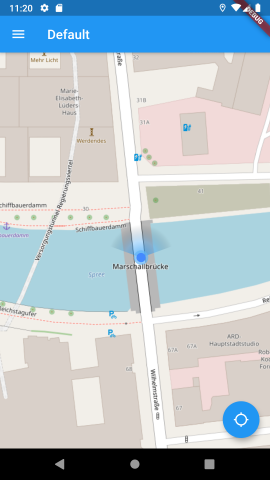
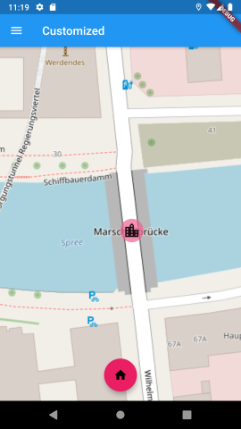

# Flutter Map – Location plugin

[](https://github.com/Xennis/flutter_map_location/actions?query=workflow%3A%22Flutter%22+event%3Apush+branch%3Amaster)

A [flutter_map](https://pub.dev/packages/flutter_map) plugin to request and display the users location and heading on the map.

## Installation

Add flutter_map to your pubspec:

```yaml
dependencies:
  flutter_map_location: any # or the latest version on Pub
```

### Android

Ensure the following permissions are present in `<project-root>/android/app/src/main/AndroidManifest.xml`:

```xml
<uses-permission android:name="android.permission.INTERNET"/>
<uses-permission android:name="android.permission.ACCESS_FINE_LOCATION" />
```

See [reference example code](https://github.com/Xennis/flutter_map_location/blob/f864b737cfe6371a297cee3be076b6bc117f572c/example/android/app/src/main/AndroidManifest.xml#L4-L5)

### iOS

Ensure the following permission is present in `<project-root>/ios/Runner/Info.plist`:

```xml
<key>NSLocationWhenInUseUsageDescription</key>
<string>App needs access to location and direction when open.</string>
```

See [reference example code](https://github.com/Xennis/flutter_map_location/blob/f864b737cfe6371a297cee3be076b6bc117f572c/example/ios/Runner/Info.plist#L5-L6)

## Usage

Look at the [default example](example/lib/pages/default.dart) and the notes inside the code. That's a working example.

## Demo / example

A working example can be found in the `example/` directory. It contains a page with the default settings:



... and one with customized button and marker:



(Map attribution: © [OpenStreetMap](https://www.openstreetmap.org/copyright) contributors)

## Credits

The plugin is inspired by [user_location_plugin](https://github.com/igaurab/user_location_plugin) by [igaurab](https://github.com/igaurab).